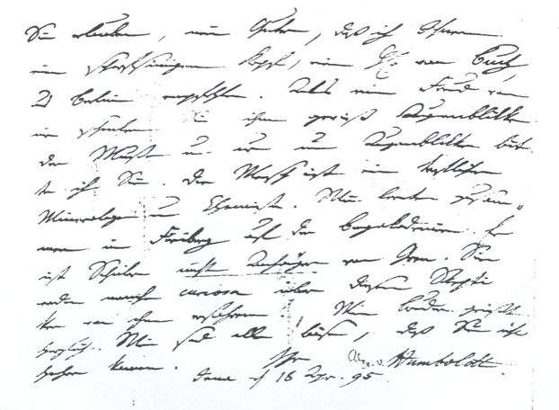

## Schnittstellen im LaZAR-Repositorium

**AP 2-3: Entwicklung von Exportschnittstellen**

**Ziel:** Entwicklung von Exportschnittstellen zur Datenbereitstellung

**Beteiligung:** VZG

**Zeit:** Monat 15-24 (im ursprünglichen Antrag)

**Grundlage:** Repositorium; Datenmodell (AP 1-3)

**Arbeitsschritte:**

* Analyse bestehender Exportschnittstellen
* Entwicklung Exportschnittstellen (OAI-PMH und LOD)
* Test und Evaluation der Exportschnittstellen
* Bereitstellung der Daten

## Umsetzung und Möglichkeiten

* easyDB greift selbst auf APIs der VZG zu (GND & Geonames)

* easyDB bietet eigene API für praktisch alle Funktionen
  (allerdings eher als Programmierschnittstelle)

* VZG setzt darauf aufbauend eine Auswahl von frei zugänglichen 
  Standard-Schnittstellen um
    * OAI-PMH
    * Linked Open Data (LOD)

*$\rightarrow$ Lesende Schnittstellen auch indirekt über Datenexport möglich!*

## OAI Protocol for Metadata Harvesting (OAI-PMH)

* Etablierter Standard (2002) zum Austausch von Metadaten aus Repositories
* Für Forschungsdaten-Repositories notwendig
* Im Wesentlichen nur eine Art von Anfrage möglich:
    * Was ist seit ... hinzugekommen oder hat sich geändert?
    * ggf. Einschränkung auf vordefinierte Gruppen von Inhalten
    
## Linked Open DATA (LOD) aka "Semantic Web"

* Vereinheitlichung aller Daten mittels URIs
    * DOI, GND, Geonames... 
* Nur für frei verfügbare Daten
* Schwerpunkt auf Verknüpfungen
    * z.B. welche Urheber (GND-URI) haben\
      zu welchen Themen (GND-URI)\
      an welchen Orten (Geonames-URI) erhoben?
* Genaue Art des Export noch offen

# Metadatenmodell und Austauschformate

## Was ist ein Medatatenmodell?

* Mögliche Arten von 
    * Inhalten (Objekttypen)
    * Beziehungen (Verknüpfungen, Relationen)
    * Werten (Datentypen und Auswahllisten)

* Grundlage von konkreten Datenformate

* Beschränkung auf *eine mögliche Art* der Beschreibung

## Beispiel: Urheber 

* Jedes Objekt (Datei, Konvolut, Ausschnitt) hat\
  *mindestens einen* **Urheber**

* Ein **Urheber** muss eine GND-ID oder ORCID-ID haben.

* Ein **Urheber** kann eine Affiliation haben (Freitext)

## LaZAR-Metadatenmodell

* Allgemeine Objekttypen
    * Dateien (Video, Audio, Bild, Text, Sonstiges)
    * Konvolute (Sammlung von Dateien und/oder Unterkonvoluten)
* Datenfelder mit verschiedenen Beschränkungen
* Einige Auswahllisten

$\Rightarrow$ Genauere Anpassung erfordert tatsächliche Forschungsdaten

## Austauschformate

* Export für Langzeitarchivierung
* Export für Suche in publizierten Forschungsdaten (DataCite)
    * Für DOI-Vergabe
    * DataCite-Format (notwendig)\
      <https://schema.datacite.org/>
* Ggf. weitere Exporte (ZIP-Archive o.Ä.)

$\Rightarrow$ Abbildung des internen Datenformat aus easyDB nach DataCite

# Zusammenfassung

## Zusammenfassung

* Schnittstellen zur Integration mit anderen Programmen
    * OAI-PMH
    * LOD
* Zwingend notwendig
    * Verknüpfung mit GND/ORCID-URIs
    * Export per OAI-PMH Schnittstelle
    * DataCite als ein Exportformat

